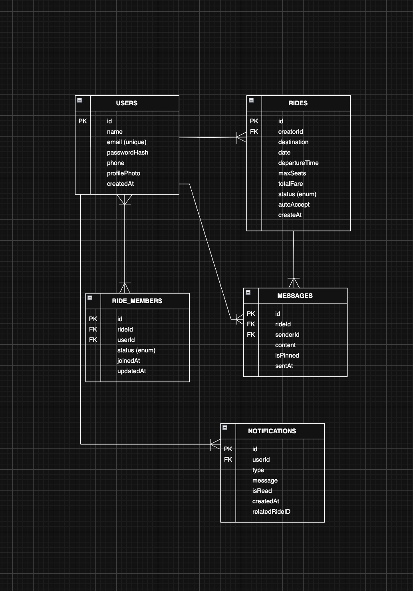

# 🚗 CampusRide

**CampusRide** is a high-performance, real-time ride-sharing platform specifically designed for university ecosystems. It empowers students to optimize their commutes by hosting or joining ride pools, splitting fares equitably, and communicating through real-time channels—all within a secure, verified university network.

## 🛠️ Tech Stack

### **Frontend**
- **Framework**: React 19 + Vite 8 (TypeScript)
- **Styling**: TailwindCSS (Premium UI with Glassmorphism)
- **Animation**: Framer Motion
- **Icons**: Lucide React
- **State/Routing**: React Router 7 + Context API
- **Real-Time**: Socket.io-client

### **Backend**
- **Runtime**: Node.js
- **Framework**: Express (MVC Architecture)
- **Database**: MongoDB + Mongoose (ORM)
- **Real-Time**: Socket.io (Engine.io)
- **Authentication**: JWT (JSON Web Tokens)
- **Communication**: Nodemailer (OTP Verification)

---

## 🏗️ Technical Architecture & Design Progress

### **1. Base Classes & Interfaces**
We utilize a robust type-system and interface architecture to define our core domain entities:
- **`User`**: Captures identity, university email verification, and profile metadata.
- **`Ride`**: The central entity managing route data, fare calculation, and status.
- **`RideMember`**: A relationship entity managing passenger status (Pending/Active) and occupancy.

### **2. Design Patterns**
We have implemented the **Strategy Pattern** for the Ride Filtering system. This allows the platform to apply multiple, interchangeable filtering algorithms without modifying core discovery logic.
- **Interface**: `RideFilter`
- **Concrete Strategies**: `DestinationFilter`, `DateFilter` 

### **3. SDLC + OOP Concepts Used**
- **Encapsulation**: Services hide complex database interactions from the entry points.
- **Abstraction**: Using TypeScript Interfaces to define strict contracts.
- **Polymorphism**: Interface-based filtering allows for interchangeable search strategies.
- **Lifecycle**: The project follows an **Agile/Iterative SDLC** methodology, transitioning from prototype to production-hardened system.

---

## 🗄️ ER Diagram & Cardinality


**Relationships:**
- **User (1) ↔️ (N) Ride (Creator)**
- **User (N) ↔️ (M) Ride (Members)**
- **Ride (1) ↔️ (N) Message**

---

## 🚀 Setup and Installation

### **1. Setup**
```bash
git clone https://github.com/yourusername/campusride.git
cd campusride
npm install
cd backend && npm install
```

### **2. Environment Configuration**
Create a `.env` file in the `backend/` directory:
```env
PORT=5001
MONGO_URI=your_mongodb_uri
JWT_SECRET=your_jwt_secret
```

### **3. Running the Project**
```bash
# Backend
cd backend && npm run dev

# Frontend
npm run dev
```

---

## 👥 Team Members and Contributions

| # | Name | Roll No. | Modules Owned |
|---|------|----------|---------------|
| 1 | **Vani Rudra** | 2401010490 | Team Lead + Backend Architecture — Auth, Ride Service, SOLID design, README & Repo setup |
| 2 | **Bulbul Agarwalla** | 2401010131 | Frontend Development — All React pages, AuthContext, routing, Class Diagram |
| 3 | **Anuradha Raghuwanshi** | 2401010087 | Real-Time & Chat — Socket.io, ChatBox component, live updates, Use Case Diagram |
| 4 | **Apoorva Choudhary** | 2401010092 | Database & API Design — Prisma schema, REST endpoints, ER Diagram |
| 5 | **Ganga Raghuwanshi** | 2401010165 | Testing & Documentation — Test cases, Sequence Diagram, Report writing |

---

**CampusRide** — *Smart Commuting for Smart Campuses.* 🎓🚗